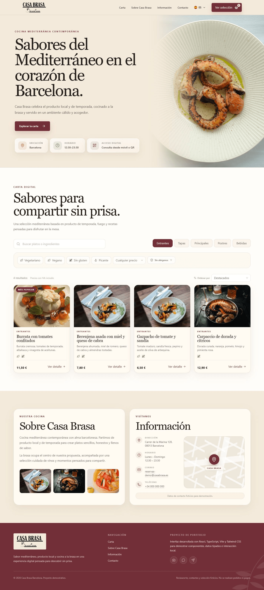
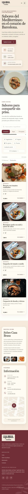

# Casa Brasa Barcelona

Carta digital responsive para un restaurante ficticio de cocina mediterránea
contemporánea en Barcelona.

El proyecto simula la experiencia de consultar una carta desde el móvil o un
código QR: permite explorar platos, buscar ingredientes, combinar filtros,
consultar información alimentaria y preparar una selección local antes de
realizar un pedido presencial.

## Funcionalidades

- navegación responsive con menú móvil;
- catálogo local de veinte platos dividido en cinco categorías;
- búsqueda por nombre, descripción e ingredientes sin diferenciar acentos;
- filtros combinables por dieta, picante, precio y alérgenos;
- filtros activos con eliminación individual y limpieza conjunta;
- ordenación por destacados y precio;
- detalle accesible de cada plato con ingredientes y alérgenos;
- control de cantidad entre 1 y 10 unidades;
- selección local con edición, eliminación y subtotal estimado;
- estados vacíos y mensajes dinámicos accesibles;
- información ficticia del restaurante y footer de portfolio;
- diseño adaptado a móvil, tablet y escritorio.

## Tecnologías

- React 19;
- TypeScript;
- Vite;
- Tailwind CSS;
- Lucide React;
- Git y GitHub.

La aplicación utiliza datos locales tipados y estado de React distribuido
mediante props. No requiere backend, base de datos ni biblioteca de estado
global.

## Calidad técnica

### Accesibilidad

- estructura semántica y enlace para saltar al contenido principal;
- navegación completa mediante teclado;
- foco visible y restauración del foco al cerrar diálogos;
- modales nativos con cierre por botón, fondo y tecla `Escape`;
- nombres accesibles y estados perceptibles en controles;
- anuncios concisos para resultados, cantidades y subtotal;
- soporte para `prefers-reduced-motion`;
- textos alternativos y contenido decorativo correctamente diferenciados.

### Responsive

La interfaz sigue un enfoque mobile first. Los controles, grids, modales y el
panel de selección se adaptan desde 320 px hasta escritorio sin desbordamiento
horizontal.

### Datos y estado

- catálogo serializable definido en TypeScript;
- imágenes asociadas fuera del modelo de datos;
- búsqueda normalizada mediante una utilidad independiente;
- filtros y ordenación derivados del estado actual;
- selección limitada a diez unidades por plato;
- subtotal calculado localmente;
- datos de selección no persistentes.

## Estructura

```text
.
|-- BLUEPRINT.md
|-- DECISIONS.md
|-- README.md
|-- index.html
|-- public/
|-- screenshots/
`-- src/
    |-- assets/
    |   |-- brand/
    |   `-- images/
    |       `-- menu/
    |-- components/
    |-- data/
    |-- types/
    |-- utils/
    |-- App.tsx
    |-- index.css
    `-- main.tsx
```

## Ejecución local

Requisitos:

- Node.js 24 o una versión LTS compatible;
- npm.

```bash
git clone https://github.com/alxnrocha/casa-brasa-barcelona.git
cd casa-brasa-barcelona
npm install
npm run dev
```

## Comandos

```bash
npm run dev
npm run lint
npm run build
npm run preview
```

## Capturas

### Escritorio



### Móvil



## Documentación

- [Blueprint](./BLUEPRINT.md): alcance, interfaz y planificación.
- [Decisiones técnicas](./DECISIONS.md): arquitectura, estado, datos,
  accesibilidad y criterios de implementación.

## Estado

La experiencia funcional está terminada y validada. Las capturas finales están
incorporadas y el enlace de despliegue se añadirá en la siguiente etapa de
publicación.

## Aviso

Casa Brasa Barcelona es una marca ficticia creada para portfolio. El
restaurante, los datos de contacto y la selección son demostrativos. La
aplicación no realiza reservas, pedidos ni pagos.

## Autor

Alexandre Rocha
