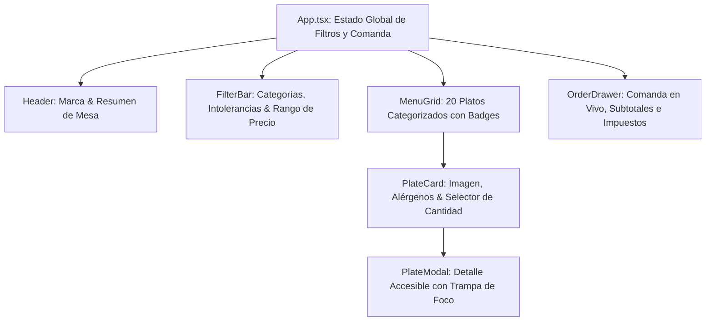

# Casa Brasa Barcelona — Carta Digital & Menú Gastronómico

<div align="center">


**Single Page Application (SPA) interactiva de alta gama para la consulta gastronómica ágil en mesa mediante código QR con filtrado dietético, control de comandas en tiempo real y estética Dark Elegance.**

[🚀 Demo en Vivo](https://alxnrocha.github.io/casa-brasa-barcelona/) • [📂 Repositorio en GitHub](https://github.com/alxnrocha/casa-brasa-barcelona)

</div>

---

## 🏛️ Arquitectura y Flujo de Componentes


```mermaid
graph TD
    App[App.tsx: Estado Global de Filtros y Comanda] --> Header[Header: Marca & Resumen de Mesa]
    App --> FilterBar[FilterBar: Categorías, Intolerancias & Rango de Precio]
    App --> MenuGrid[MenuGrid: 20 Platos Categorizados con Badges]
    MenuGrid --> PlateCard[PlateCard: Imagen, Alérgenos & Selector de Cantidad]
    PlateCard --> PlateModal[PlateModal: Detalle Accesible con Trampa de Foco]
    App --> OrderDrawer[OrderDrawer: Comanda en Vivo, Subtotales e Impuestos]
```

---

## ✨ Características Principales

- **Catálogo Gastronómico Interactivo:** 20 platos divididos en 5 categorías con ingredientes detallados, sellos de denominación de origen y alérgenos.
- **Búsqueda y Filtros Combinados:** Búsqueda normalizada por texto y filtros multicriterio (vegetariano, sin gluten, picante, rango de precio).
- **Gestión de Comanda y Subtotal en Vivo:** Control dinámico de cantidades (1 a 10 unidades), cálculo automático en Euros (€) y panel lateral de selección.
- **Modales Accesibles (WCAG 2.1 AA):** Diálogos de detalle de plato accesibles por teclado con control de foco y cierre con tecla `Escape`.
- **Diseño Mobile-First & Dark Elegance:** Paleta cromática cálida inspirada en cocina a la brasa con tipografía moderna y micro-animaciones fluidas.

---

## 🗂️ Estructura del Proyecto

```text
03-casa-brasa-barcelona/
├── index.html
├── src/
│   ├── components/                # Componentes React (MenuGrid, PlateModal, OrderDrawer, FilterBar)
│   ├── data/                      # Fixtures gastronómicas estructuradas
│   ├── types/                     # Definiciones e interfaces TypeScript
│   ├── App.tsx                    # Componente raíz con estado de comanda
│   └── main.tsx                   # Punto de entrada de React 19
├── package.json
├── tsconfig.json
└── vite.config.ts
```

---

## 🚀 Instalación y Puesta en Marcha

### Prerrequisitos
- Node.js `>= 20.0.0`
- npm `>= 10.0.0`

### Ejecución Local
```bash
# 1. Clonar el repositorio
git clone https://github.com/alxnrocha/casa-brasa-barcelona.git
cd casa-brasa-barcelona

# 2. Instalar dependencias
npm install

# 3. Iniciar servidor de desarrollo
npm run dev

# 4. Compilar para producción
npm run build
```

---

## 🛠️ Tecnologías Utilizadas

| Capa | Tecnología | Aspectos Clave |
|---|---|---|
| **Framework** | React 19 | Hooks modernos (`useState`, `useMemo`, `useCallback`), Componentes funcionales |
| **Lenguaje** | TypeScript 5.8 | Interfaces estrictas de catálogo, comanda y alérgenos |
| **Estilos** | Tailwind CSS v4 | Tokens Dark Elegance, micro-animaciones fluidas |
| **Bundler** | Vite 6.0 | HMR ultrarrápido y optimización de bundle de producción |
| **Despliegue** | GitHub Pages | Despliegue estático continuo con base path configurado |

---

<div align="center">
  <sub>Desarrollado con dedicación por <a href="https://github.com/alxnrocha">Alex Rocha</a> • Proyecto 03 del Portafolio Profesional Frontend.</sub>
</div>
